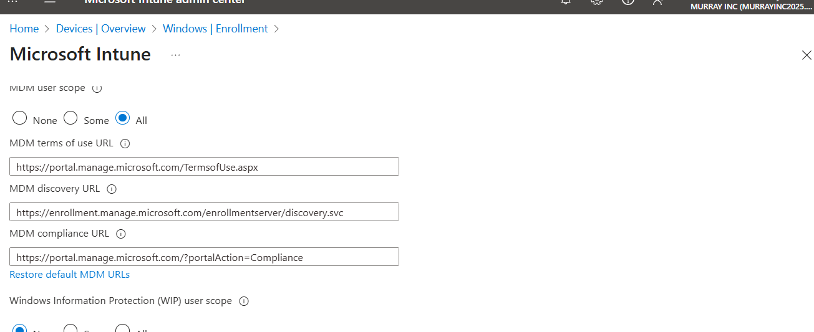
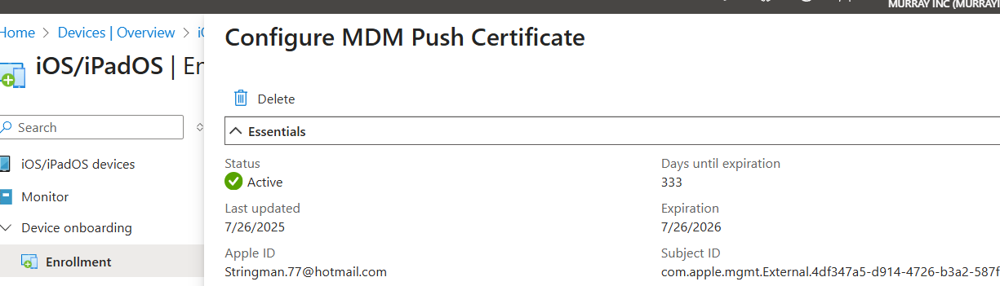
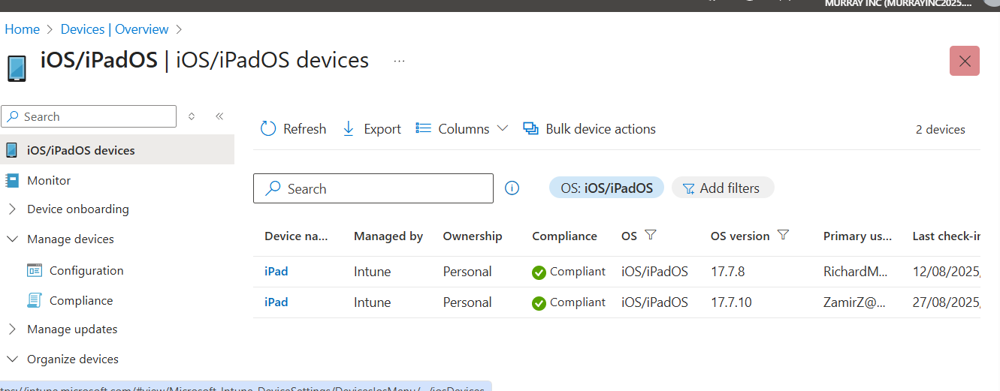
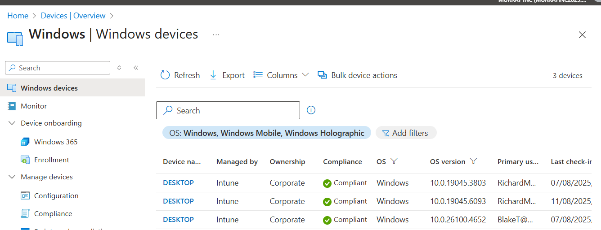
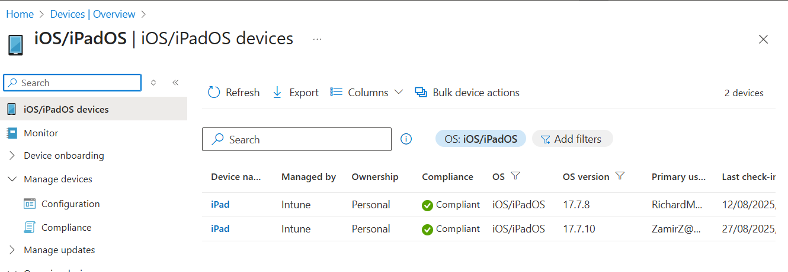

# 📲 Device Enrollment Lab — Windows & iOS via Microsoft Intune

This lab demonstrates how I enrolled Windows and iOS devices into Microsoft Intune to simulate real-world device management scenarios. I walked through initial setup, MDM authority, Apple MDM certificate, and confirmed compliance policy application to enrolled devices.

---

## 🧪 Lab Goals

- ✅ Set MDM authority in Intune
- ✅ Configure and upload Apple MDM push certificate
- ✅ Enroll personal iPad using Company Portal
- ✅ Enroll Windows 10/11 device into Intune
- ✅ Confirm devices appear in Intune portal with expected compliance
- ✅ Begin testing compliance policies (iOS & Windows)

---

## 🛠 Tools & Licenses Used

- Microsoft 365 Business Premium (trial license)
- Microsoft Intune admin center
- Company Portal app (iOS)
- iPad (BYOD scenario)
- Windows 10 desktop (manual enrollment)
- Microsoft Edge (for portal access and certificate upload)

---

## 🔧 Key Steps

1. **Set MDM Authority**  
   Confirmed MDM is active and URLs configured correctly under *Mobility (MDM & MAM)*.

2. **Apple MDM Push Certificate**  
   Generated CSR, created Apple MDM certificate via Apple Business Manager, and uploaded to Intune.

3. **Enroll iOS Device**  
   - Downloaded and installed Company Portal app on iPad  
   - Signed in with test account  
   - Completed enrollment workflow and verified management profile  
   - Applied basic compliance policy (passcode, OS version, etc.)

4. **Enroll Windows 10 Device**  
   - Joined Windows 10 device to Azure AD  
   - Confirmed device sync and management status in Intune  
   - Manual sync and troubleshooting as needed

5. **Autopilot CSV Attempt (Troubleshooting)**  
   - Attempted Autopilot import from older Windows 10 desktop  
   - Failed due to missing TPM and Secure Boot  
   - Useful troubleshooting insight for future lab (captured in notes)

---

## 📷 Sample Screenshots

| Screenshot | Description |
|-----------|-------------|
|  | MDM authority and discovery URLs in Intune |
|  | Active Apple MDM push certificate |
|  | Personal iPad showing enrolled and compliant |
|  | Windows 10 device enrolled and syncing |
|  | iOS compliance policy settings applied |

> 📁 All screenshots are stored in: `01-device-enrollment/screenshots/`

---

## 🧠 Key Takeaways

- Enrolling a BYOD iPad showed me how MDM and MAM apply differently to personal devices.
- Windows manual enrollment was straightforward, but limitations on older hardware (TPM, Secure Boot) impacted Autopilot testing.
- Learning how to generate, upload, and renew an Apple MDM certificate is a must for iOS support in production.
- The compliance policy applied successfully, confirming correct enrollment flow.

---
