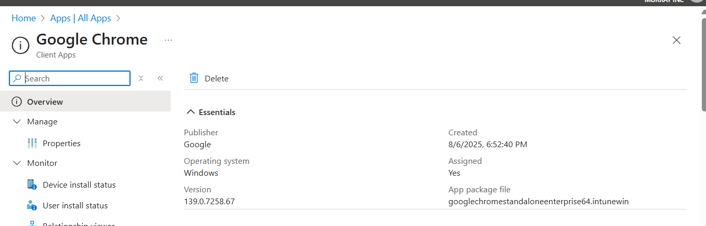
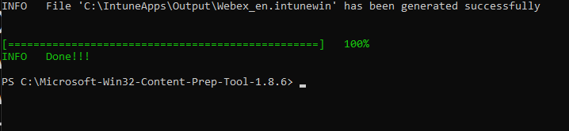
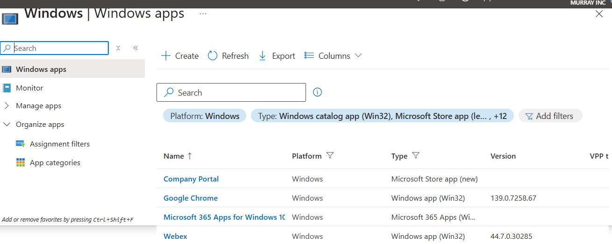
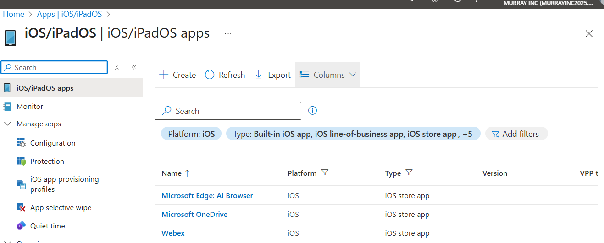
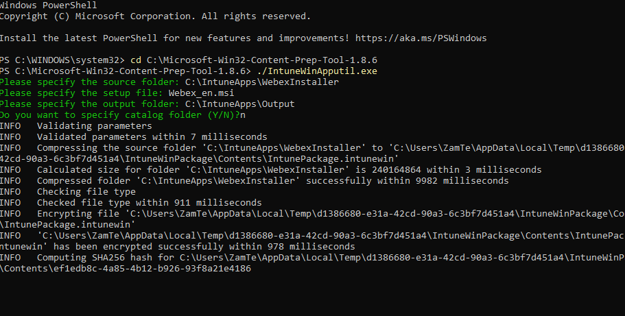
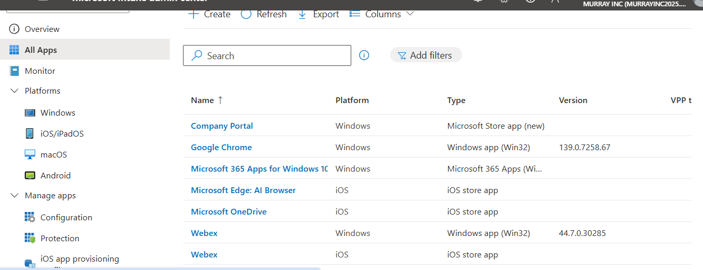

# 📦 App Deployment via Microsoft Intune

This section documents the process of packaging and deploying applications using Microsoft Intune, including Win32 apps, Microsoft Store apps, and iOS store apps. The goal was to replicate a real-world environment where apps are delivered securely and consistently to managed devices across platforms.

---

## 🚀 Deployment Scenarios Tested

| Platform | App Name              | Deployment Type        | Success |
|----------|-----------------------|-----------------------|---------|
| Windows  | Google Chrome         | Win32 (.intunewin)    | ✅ Yes  |
| Windows  | Company Portal        | Microsoft Store (New) | ✅ Yes  |
| Windows  | Webex                 | Win32 (.intunewin)    | ✅ Yes  |
| Windows  | Microsoft 365 Apps    | Built-in Office Policy| ✅ Yes  |
| iOS      | Microsoft Edge        | iOS Store App         | ✅ Yes  |
| iOS      | OneDrive              | iOS Store App         | ✅ Yes  |
| iOS      | Webex                 | iOS Store App         | ✅ Yes  |

---

## 📁 Tools Used

- Microsoft Intune Admin Center  
- Microsoft Win32 Content Prep Tool (`IntuneWinAppUtil.exe`)  
- iOS and Windows devices (enrolled in Intune)  
- Google Chrome MSI installer  
- Hyper-V VM for testing deployments  

---

## 🧪 Win32 App Deployment Example: Google Chrome

### Objective

Deploy Google Chrome (Enterprise MSI) to Windows 10/11 devices using Intune as a Win32 application.

### Steps Taken

1. Downloaded the 64-bit MSI installer for Google Chrome.  
2. Created the folder structure: `C:\IntuneApps\ChromeInstaller`  
3. Placed the MSI in the folder and ran the Microsoft Win32 Content Prep Tool:

   ~~~powershell
   IntuneWinAppUtil.exe -c C:\IntuneApps\ChromeInstaller -s googlechromestandaloneenterprise64.msi -o C:\IntuneApps\Output
   ~~~

4. Uploaded the `.intunewin` package to Intune > Apps > Windows > Add Win32 app.  
5. Filled in app metadata (name, version, publisher, install/uninstall commands).  
6. Defined the **detection rule** using MSI product code.  
7. Assigned the app to the test deployment group.  
8. Monitored installation status in Intune Admin Center.

---

## 🔍 Detection Rule

Example used for Chrome MSI:

- **Rule type**: MSI  
- **MSI Product Code**: {FMSI Product Code: {1AD350D9-EB94-39CE-AF8A-20E1C9A4993C}  
- **Detection method**: MSI product exists  

---

## 📸 Key Screenshots

### Chrome Win32 App Configuration

### Detection Rule for Chrome MSI

### Chrome Deployment Status in Intune

### Windows Apps Assigned - (Company Portal, Chrome, Microsoft 365, Webex)

### iOS Apps Assigned (Edge, OneDrive, Webex)

### Win32 Content Prep Tool Packaging

### All Apps Overview in Intune

---

## 🧰 Troubleshooting Steps

- Verified installation logs on device: `C:\ProgramData\Microsoft\IntuneManagementExtension\Logs`  
- Manually synced device from Intune Company Portal.  
- Confirmed detection rules and install commands are correct.  
- Checked device assignment groups and device compliance.  
- Repackaged app if content was corrupted or installation failed.

---

