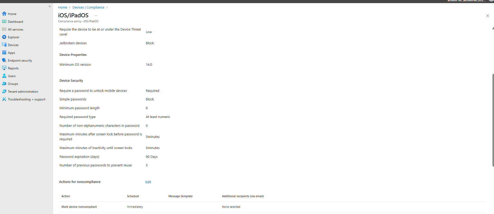
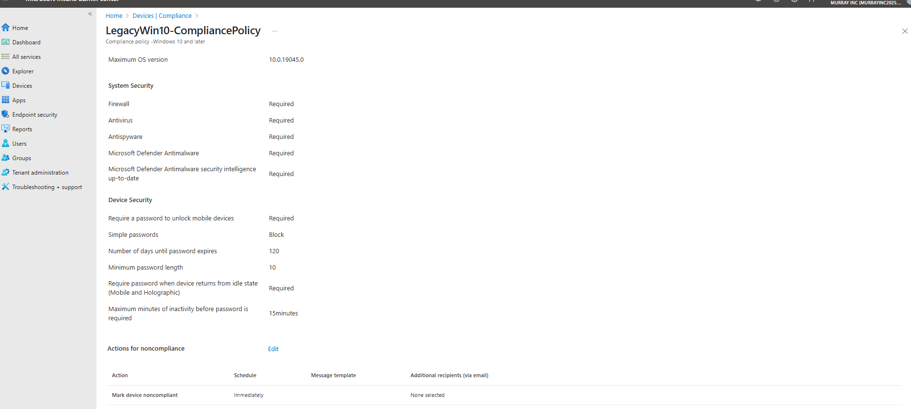
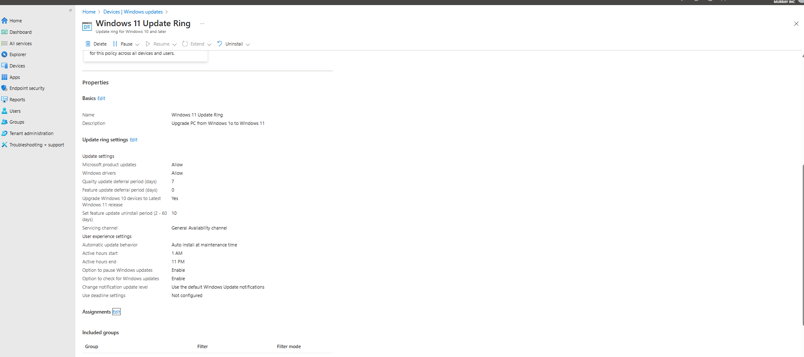
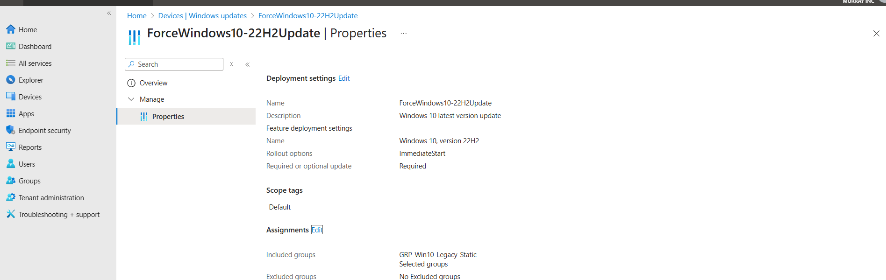
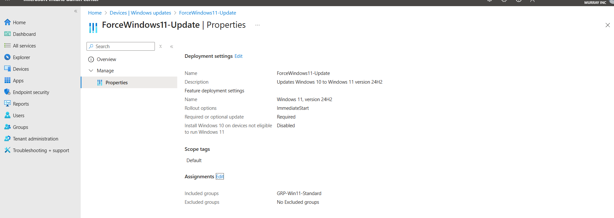

# 🔐 Compliance & Configuration Policies

This section covers all compliance, configuration, and update policies created in Microsoft Intune for both Windows and iOS/iPadOS devices. These policies help ensure that enrolled devices meet baseline security standards and stay up-to-date with OS and antivirus protections.

---

## 🎯 Objective

To enforce secure configurations across test devices (Windows 10, Windows 11, and iPadOS) by applying realistic compliance policies and update rings that would mirror enterprise baseline requirements.

---

## 💼 Platforms Covered

- **Windows 10 & 11**
  - Compliance: BitLocker, Defender Antivirus, Password policies
  - Configuration: Device restrictions, security baselines
  - Updates: Feature Update Policies & Update Rings
- **iOS/iPadOS**
  - Compliance: Jailbreak detection, OS version, password enforcement

---

## 🧪 Policies Created

| Name | Platform | Type | Purpose |
|------|----------|------|---------|
| `iOS/iPadOS` | iOS/iPadOS | Compliance | Enforce device health & security posture for iPad |
| `LegacyWin10-CompliancePolicy` | Windows 10 | Compliance | For older Win10 machines that don’t support Win11 |
| `Windows10_11_CompliancePolicy` | Windows 10/11 | Compliance | Unified policy for modern Windows devices |
| `Windows 11 Update Ring` | Windows 10/11 | Update Ring | Deliver updates on schedule to Win11 devices |
| `Windows 10 Update Ring` | Windows 10/11 | Update Ring | Deliver updates to legacy Win10 test device |
| `ForceWindows10-22H2Update` | Windows 10 | Feature Update | Force upgrade to version 22H2 |
| `ForceWindows11-Update` | Windows 11 | Feature Update | Force upgrade to version 24H2 |

---

## 🛠 Configuration Highlights

### ✅ iOS Compliance Policy
- Jailbreak detection: Block
- Minimum OS: 14.0
- Password required, min 6 digits, 90-day expiration
- Device Threat Level: Low

### ✅ Windows 10/11 Compliance
- BitLocker required
- Defender Antivirus must be active
- Password policy: complexity & screen lock timers
- Secure Boot & TPM required (Win11 only)

### ✅ Configuration Profiles
- One created for Windows security baseline on legacy Windows 10 system
- Baseline configuration restrictions to match Intune standards

### ✅ Feature Update Policies
- Enforced version targeting:
  - Windows 10 → version 22H2
  - Windows 11 → version 24H2

---

## 🐛 Troubleshooting Notes

- Legacy PC used in lab lacked TPM & Secure Boot → failed to register Autopilot profile
- Win10 compliance policy was adjusted to accommodate this older hardware
- Some policies showed “in progress” until next scheduled sync

---

## 🔍 Screenshots

### iOS Compliance Policy  

### Windows 10 Legacy Compliance Policy  

### Windows 10/11 Unified Compliance Policy  

### Windows 11 Update Ring  

### Force Windows 10 Feature Update to 22H2  

### Force Windows 11 Feature Update to 24H2  

---

